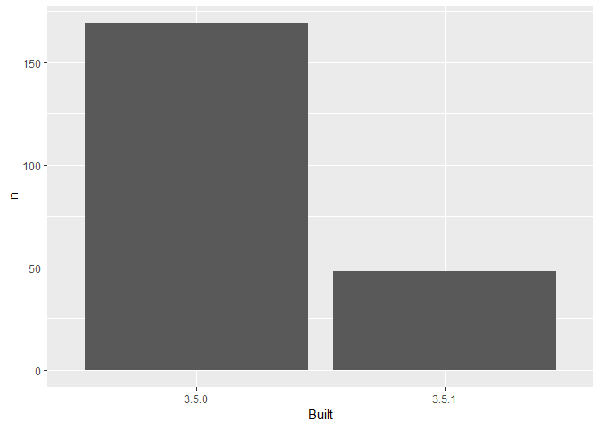

03\_barchart-packages-built.R
================
morrism
Thu Oct 04 14:58:38 2018

``` r
## remember to restart R here!

## make a barchart from the frequency table in data/add-on-packages-freqtable.csv

## read that csv into a data frame
## hint: readr::read_csv() or read.csv()
## idea: try using here::here() to create the file path

library(readr)
library(here)
```

    ## here() starts at F:/Work/RWTF/explore-libraries

``` r
apt_freqtable <- readr::read_csv(here("Data", "mmapt-table.csv"))
```

    ## Parsed with column specification:
    ## cols(
    ##   Built = col_character(),
    ##   n = col_integer(),
    ##   prop = col_double()
    ## )

``` r
## if you use ggplot2, code like this will work:
library(ggplot2)
ggplot(apt_freqtable, aes(x = Built, y = n)) +
  geom_bar(stat = "identity")
```



``` r
## write this barchart to figs/built-barchart.png
## if you use ggplot2, ggsave() will help
## idea: try using here::here() to create the file path

## YES overwrite the file that is there now
## that came from me (Jenny)
```
